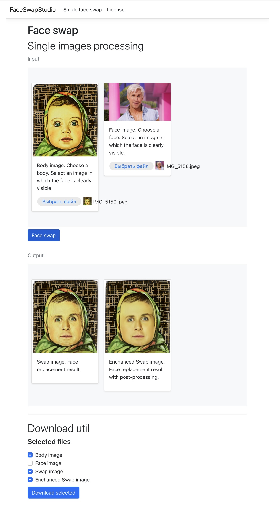

# Introduction

FaceSwapStudio is a face swapping program that allows you to deploy a web interface for face swapping right on your local network.

# Features
* ML face swap
* ML face improvement (after face swap)

<br/>



# Compatibility
Tested operating sysyem and hardware: macOS arm (MacBook Air M1 8 GB) and desktop computers (windows and ubuntu) (intel cpu: 12 gen i5, nvidia gpu: gtx 3060; intel cpu: 12 gen i9, nvidia gpu:  rtx 4080)

# Installation and Running
Clone project

## Third party components

### Stable diffusion webui
Stable diffusion webui https://github.com/AUTOMATIC1111/stable-diffusion-webui used for face improvement.
<br/>
Install on your computer using the instructions from the repository for your platform.
<br/>
<br/>
Run stable diffusion webui with flag: `--api`. Add flag `--listen` if you want to run this from other computer from your local network.

## Python modules
Install these modules on your computer (virtual environment for *faceSwapApi/face_swap_api.py* or global)
* insightface
* onnxruntime
* uvicorn
* fastapi

## Face swap model file
Download *inswapper_128.onnx* from https://huggingface.co/bes-dev/roop/blob/main/inswapper_128.onnx and place model in *faceSwapApi/core/*

## .NET
Project tested by .NET 8, but you can try other version if you want. Follow Microsoft's instructions to install .net for your operating system.

## .NET development ide
Install visual studio or jet brains rider or visual studio code and setup it for .NET development.

# Build in components

## Face swap api
*faceSwapApi/face_swap_api.py* is service responsible for face swap.
<br/>
<br/>
Open *faceSwapApi/face_swap_api.py* ApiConfiguration.json and set `IsLocalNetworkAvailable: true` if you want to share this api through your local network. If you want to run api only on your computer set `IsLocalNetworkAvailable: false`.
<br/>
<br/>
localhost exemple:
```
{
  "IsLocalNetworkAvailable": false
}

```
share exemple:
```
{
  "IsLocalNetworkAvailable": true
}
```

After download python modules, download models, setup network accessibility. Just run *faceSwapApi/face_swap_api.py* by your python interpreter.
The first launch may be a long time because insightface will load the necessary models.

## FaceSwapStudioWeb is web ui for face swap.
Open it in your .NET ide.

### Setup *FaceSwapStudioWeb/FaceSwapStudioWeb/ExternalApiSettings.json*:

Set url for *ApiUrl:FaceSwapApi* if you run *faceSwapApi/face_swap_api.py* on other computer or leave it by default 127.0.0.1 if you run api on same computer.
Set url for *ApiUrl:StableDiffusionApiUrl* if you run stable diffusion webui on other computer or leave it by default 127.0.0.1 if you run this on same computer.
<br/>
<br/>
localhost example:

```
{
  "ApiUrl": {
    "FaceSwapApi": "http://127.0.0.1:8000",
    "StableDiffusionApiUrl": "http://127.0.0.1:7860"
  }
}
```

share example:
```
{
  "ApiUrl": {
    "FaceSwapApi": "http://192.168.0.104:8000",
    "StableDiffusionApiUrl": "http://192.168.0.104:7860"
  }
}
```
### Setup *FaceSwapStudioWeb/FaceSwapStudioWeb/Properties/launchSettings.json*:
Replace localhost in *profiles* section to your computer local network v4 url if you want to share web ui through your local network or leave it by default localhost if you don't want to do it.
<br/>
<br/>
localhost example:
```
{
  "$schema": "http://json.schemastore.org/launchsettings.json",
  "iisSettings": {
    "windowsAuthentication": false,
    "anonymousAuthentication": true,
    "iisExpress": {
      "applicationUrl": "http://localhost:43163",
      "sslPort": 44350
    }
  },
  "profiles": {
    "http": {
      "commandName": "Project",
      "dotnetRunMessages": true,
      "launchBrowser": true,
      "applicationUrl": "http://localhost:5018",
      "environmentVariables": {
        "ASPNETCORE_ENVIRONMENT": "Development"
      }
    },
    "https": {
      "commandName": "Project",
      "dotnetRunMessages": true,
      "launchBrowser": true,
      "applicationUrl": "https://localhost:7186;http://localhost:5018",
      "environmentVariables": {
        "ASPNETCORE_ENVIRONMENT": "Development"
      }
    },
    "IIS Express": {
      "commandName": "IISExpress",
      "launchBrowser": true,
      "environmentVariables": {
        "ASPNETCORE_ENVIRONMENT": "Development"
      }
    }
  }
}
```

share example:
```
{
  "$schema": "http://json.schemastore.org/launchsettings.json",
  "iisSettings": {
    "windowsAuthentication": false,
    "anonymousAuthentication": true,
    "iisExpress": {
      "applicationUrl": "http://localhost:43163",
      "sslPort": 44350
    }
  },
  "profiles": {
    "http": {
      "commandName": "Project",
      "dotnetRunMessages": true,
      "launchBrowser": true,
      "applicationUrl": "http://192.168.0.104:5018",
      "environmentVariables": {
        "ASPNETCORE_ENVIRONMENT": "Development"
      }
    },
    "https": {
      "commandName": "Project",
      "dotnetRunMessages": true,
      "launchBrowser": true,
      "applicationUrl": "https://192.168.0.104:7186;http://192.168.0.104:5018",
      "environmentVariables": {
        "ASPNETCORE_ENVIRONMENT": "Development"
      }
    },
    "IIS Express": {
      "commandName": "IISExpress",
      "launchBrowser": true,
      "environmentVariables": {
        "ASPNETCORE_ENVIRONMENT": "Development"
      }
    }
  }
}
```
Launch the web application. The first face replacement may be a long time because stable diffusion webui will load the necessary models.
Urls from *applicationUrl* is urls to web app for your network or localhost.